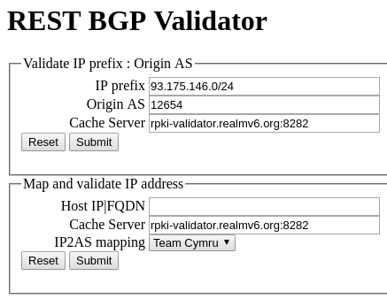

Tools based on the RTRlib
=========================

Browser Plugins
---------------

.. |valid| image:: ../images/valid.png

.. |invalid| image:: ../images/invalid.png

.. |not_found| image:: ../images/notFound.png

To check prefixes while browsing the internet there is a validation tool for Firefox and Chrome. The Firefox add-on
`RPKI-Validator <https://addons.mozilla.org/en-US/firefox/addon/rpki-validator/>`_
shows the user whether the currently visited website has a valid prefix. A small icon indicates the status, which is either
valid (|valid|), invalid (|invalid|) or was not found (|not_found|).

Chrome user can profit from the extension aswell, but they will have to install it by hand.
First download the `Chrome extension <https://github.com/rtrlib/chrome-extension>`_ from GitHub. Now open a new tab in
the browser and enter ``chrome://extensions``. Activate the checkbox that says `Developer Mode` in the top right corner.
Now click the `Load unpacked extension` button and navigate to the source directory of the downloaded files.
The package is now installed and can be used just like the Firefox add-on.

RPKI READ
---------

The *RPKI Realtime Dashboard* (READ)

RPKI MIRO
---------

The RPKI *Monitoring and Inspection of RPKI Objects* (MIRO)

RPKI RBV
--------

The RPKI *RESTful BGP Validator* (RBV) offers the ability to host BGP validation on your own.
An example of how it could look like can be found `here <http://rpki-validator.realmv6.org/html/validate.html>`_.
If a query like the one in the picture is sent, the result will be a JSON Object like this one

.. code-block:: JSON

  { "asn": "12654", "cache_server": "rpki-validator.realmv6.org:8282", "code": 1, "message": "Valid", "prefix": "93.175.146.0/24" }

To speak to the API via GET, send a request in the format

| your.webserver.net/api/v1/validity/<asn>/<prefix>/<masklen>[?params]
|

Note that the <asn> must be prepended by `AS`, e.g.,

| rpki-rbv.realmv6.org/api/v1/validity/AS12654/93.175.146.0/24
|

This time the resulting JSON will be a bit more detailed

.. code-block:: JSON

  {"validated_route": {"info": {"origin_country": "EU", "origin_asname": "RIPE-NCC-RIS-AS Reseaux IP Europeens Network Coordination Centre (RIPE NCC), EU"}, "route": {"prefix": "93.175.146.0/24", "origin_asn": "AS12654"}, "validity": {"state": "Valid", "code": 0, "description": "At least one VRP Matches the Route Prefix", "VRPs": {"unmatched_as": [], "unmatched_length": [], "matched": [{"prefix": "93.175.146.0/24", "max_length": "24", "asn": "AS12654"}]}}}}

For a detailed instruction how to install and set up the API visit the `RBV Repository <https://github.com/rtrlib/rbv>`_ on GitHub.

RTRlib Python Binding
---------------------
